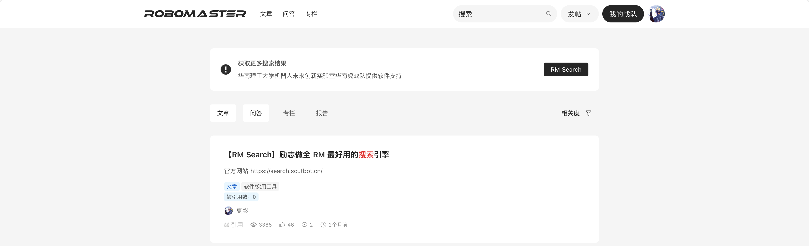
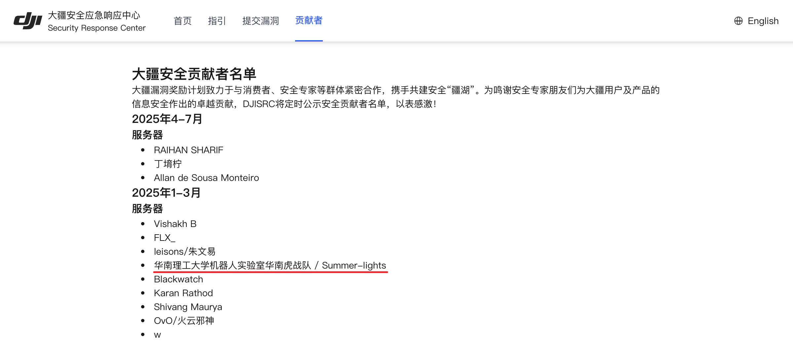
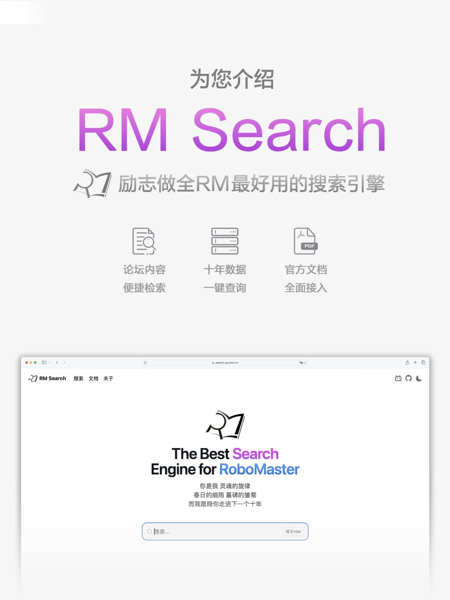
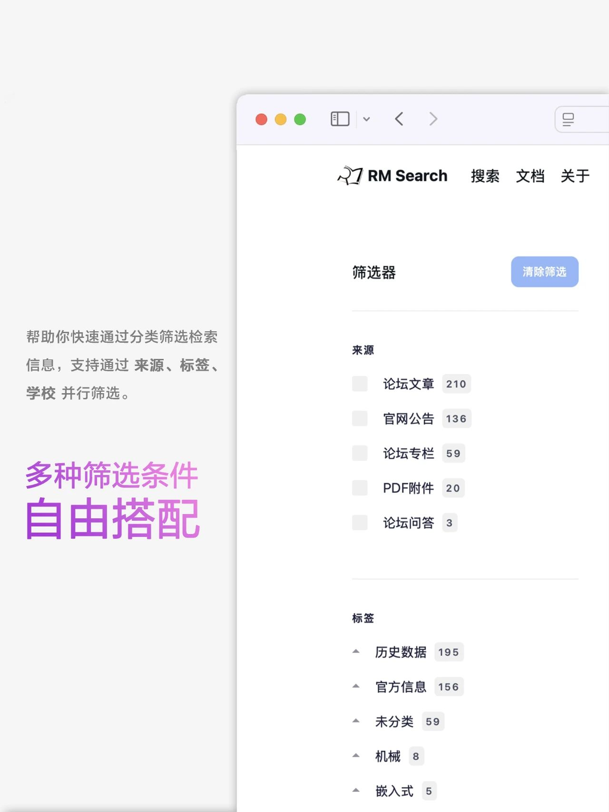
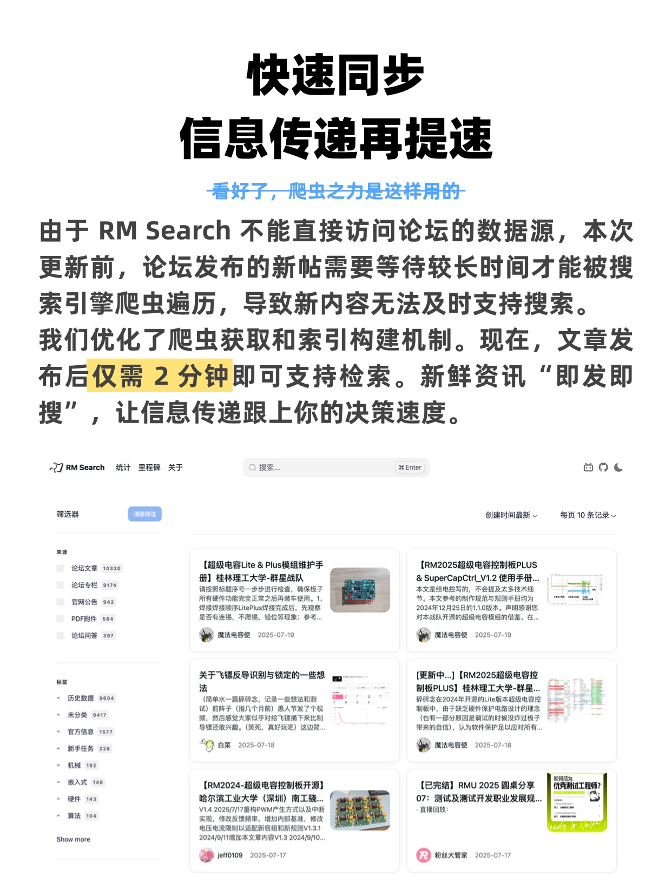

# RM Search 励志做全 RM 最好用的搜索引擎


RM Search 是一个前后端分离的项目，当前仓库是后端仓库。

生产环境 https://search.scutbot.cn/

前端仓库 https://github.com/scutrobotlab/rm-search-heroui

## 功能介绍

RM Search 是一个专为 RoboMaster 赛事打造的搜索引擎。

在这里，你可以一键搜索 RM 论坛文章、问答和专栏，亦可搜索 RM 官网公告和 PDF 内的文本。

## 发展历史

完整版本见里程碑 https://search.scutbot.cn/milestone

省流版本：2025年1月20日，B站up主 --Action--
发布了关于论坛搜索的吐槽视频，引起了广泛关注和讨论。我们受此启发开始了产品的构思。项目于同年1月21日启动，于2月16日完成首个最小功能集，并于3月9日正式发布。

## 主要成就

### 主线任务

2025年3月9日 RM Search 正式发布，发布推文在圈内被广泛转发，截至目前已获得 4000+ 的阅读量。


2025年3月18日 RoboMaster 官方论坛接入 RM Search，在论坛搜索后将在顶部展示 RM Search 的提示。



2025年8月5日 RM Search 响应的搜索量首次突破 10 万次，发布半年内服务了众多青年工程师。

### 意外收获

开发爬虫的过程中，我们意外发现了服务器漏洞，并第一时间向大疆安全应急响应中心报告了该漏洞。大疆第一时间核实并修复了该漏洞。因此，华南理工大学机器人实验室华南虎战队成功被大疆安全贡献者名单收录。

注：本文对于该漏洞信息的披露程度符合有关规定和已有协议。

贡献者 https://security.dji.com/zh/contributors



## 效果展示

首发推文 https://mp.weixin.qq.com/s/hE9bwNWO0XdwbaMTxsrSzQ

更新推文 https://mp.weixin.qq.com/s/rLSAF9DuE4GUPKvW90DyZQ

<table>
  <tr>
    <td></td>
    <td></td>
  </tr>
</table>

<table>
  <tr>
    <td></td>
    <td></td>
    <td></td>
  </tr>
</table>

<table>
  <tr>
    <td></td>
    <td></td>
  </tr>
</table>

## 技术方案

### 依赖工具、环境

- Go 1.25
- Docker
- PostgreSQL 16
- Meilisearch 1.12
- Apache Tika

### 编译、安装方式

#### 填写配置

请先确保你已经启动了 PostgreSQL 和 Meilisearch

数据库建表 DDL 位于 database/schema/rm_search.sql, 已内嵌进二进制, 服务启动时自动应用 (幂等), 无需手动建表

```Bash
# 复制配置文件模版
cp etc/config.template.yaml etc/config.yaml

# 按需修改 etc/config.yaml 的配置
vim etc/config.yaml
```

RoboMaster 论坛需要登录后才能访问。你需要先登录论坛，再从控制台 Cookies 中获取 `_meta_key` 的值，填入配置文件的
`DJIMetaKey` 字段。

#### 获取数据

你需要先从 RM 论坛和公告中获取数据，并保存在数据库中。

index/persistence_test.go 文件中提供了一系列用于从各个数据源获取数据的单元测试。

#### 构建索引

将数据保存到数据库后，需要在 Meilisearch 中构建索引。

你可以执行 index/index_test.go 中的 TestIndexer_RecreateIndex 函数。

也可以在配置 AdminToken 后通过 API 调用异步重建索引。

```Bash
curl --location --request POST 'http://localhost:8080/admin/recreate-index?async=true' \
--header 'Authorization: Bearer system' \
--header 'Accept: */*' \
--header 'Host: localhost:8080' \
--header 'Connection: keep-alive'
```

#### 本地运行

完成索引构建后，你就可以从主函数启动。

```Bash
go run .
```

#### Docker 镜像

你也可以构建用于生产环境的 Docker 镜像。

```Bash
docker build -t rm-search:latest .
docker run -p 8080:8080 --name rm-search rm-search:latest
```

### 目录结构及用途

- **common** 公共资源，存放各模块复用的代码、工具函数等。
- **database** 数据库操作相关
    - **model** 数据模型，定义与数据库表对应的实体类。
    - **query** 数据库查询，存放 CRUD 等操作代码。
- **etc** 存放配置文件和模板。
- **index** 索引相关
    - **dict** 索引词典，存放分词表。
    - **mapping** 索引映射，定义索引字段类型等。
- **job** 定时任务，存放定时数据同步等任务代码。
- **recover** 有次误操作导致数据丢失，需要提取 BIN LOG 复原数据。
- **server** 服务/接口相关
    - **handler** 请求处理，处理客户端请求并返回响应。
    - **middleware** 中间件，如身份验证。
- **svc** 存放配置文件和服务上下文。
- **unittest** 单元测试

### 原理介绍

获取：为 RM 官网和论坛定制的爬虫通过“全量创建+增量更新”的方式获取数据。此外内置定时爬取任务 (每天 0/6/12/18 点): 先将最新帖子倒序爬取至追新水位, 再以水位线向历史帖子回填, 触底后自动标记完成并停止历史爬取, 之后仅追新 (水位持久化于 `crawl_state` 表, 重启不回填)。

持久化：爬虫将获取到的数据写入数据库并进行持久化。

索引：将数据库中持久化的数据写入 Meilisearch 构建索引。

Meilisearch 使用分词后的文本基于倒排索引的数据结构提供高效的检索服务。

### RoadMap

虽然 RM Search 发源于论坛搜索的需求。但早在 2025年1月23日，团队就已经明确了更高的目标。我们认为与其做最好的论坛搜索引擎，不如做最好的
RM 社区搜索引擎。我们计划继续索引官网公告， 同时将B站、微信公众号等自媒体的内容也纳入搜索范围。 基于大量的公开资料，自动为每支队伍立传，最后发展成
RM 的《史记》。

时至今日，部分设想已经实现。但苦于有限的人力，截止至 2025 赛季末，我们仍未能完成最初设想的目标。

- 支持 B 站视频搜索
- 支持夜间自动全量索引构建
- 搜索学校战队进独立详情页
- 显示 17-25 赛季的历史对局
- 与 Schedule 联动支持搜索对局
- 优化深色模式适配

## 贡献者&致谢

### 研发团队

**后端工程师**

2023赛季信息组组长 常霆钰

**前端工程师**

2023赛季信息组组长 常霆钰

**运维工程师**

2024&2025赛季软件开发组组长 罗棨文

2023赛季信息组组长 常霆钰

**宣传运营**

2023赛季宣运组组长 杨卓石

**LOGO 设计**

2024赛季软件开发组组长 温欣怡

### 致谢

感谢大疆创新 RoboMaster 组委会，感谢论坛产品经理叶楚天。

感谢内测用户首都师范大学W.PIE 张盛博、湖南大学跃鹿 王文喆提出的宝贵意见。